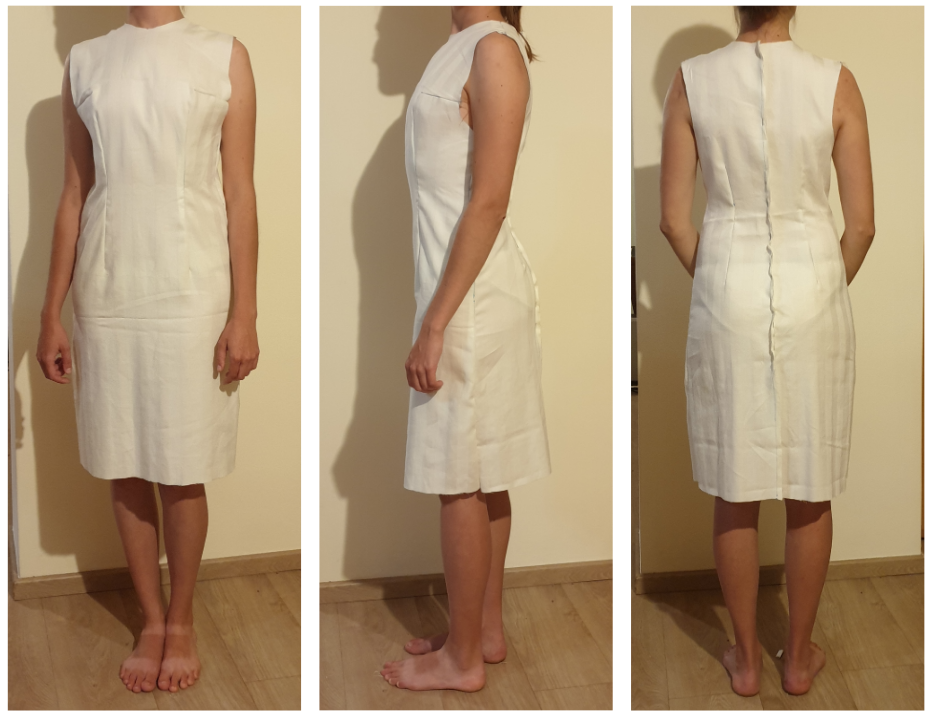

# Vykreslování základních oděvních střihů
### Zápočtový program z NPRG035	Jazyk C# a platforma .NET

- generování základních oděvních střihů podle zadaných měr
- [uživatelská dokumentace](uziv_doku.pdf)
- [programátorská dokumentace](doku.pdf)
- ukázka střihu na šaty vygenerovaného programem:

